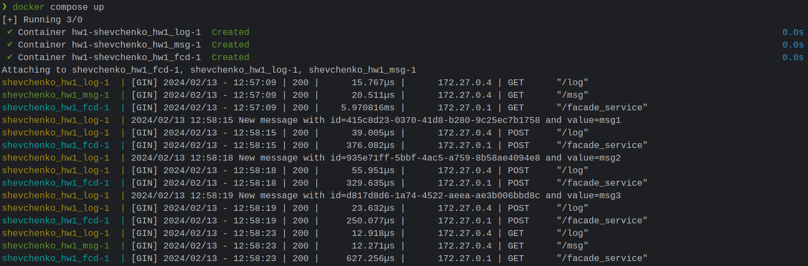
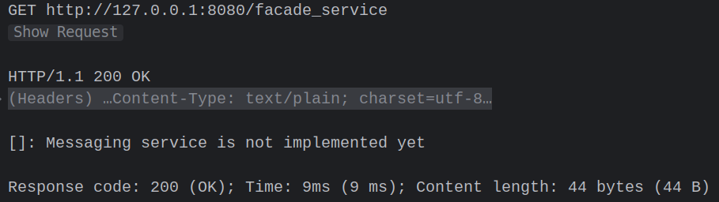
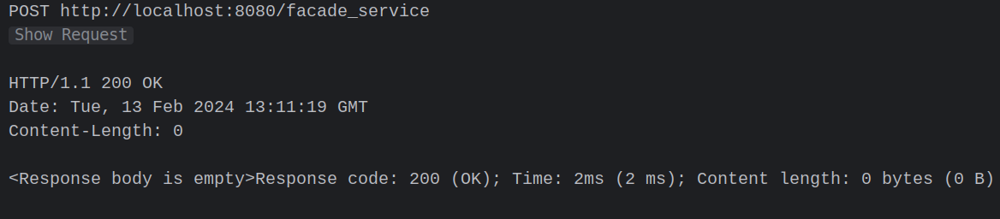
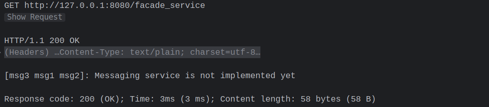

# Homework 1: Basic microservice architecture

Author: **Shevchenko Ivan**

## 📝 Description

In this Homework I have created three web based microservices using GO connected
them together and wrapped each one of them into its own docker image.

## 🖥 Usage

To run the application do the following steps:

1. Clone the repository
2. Move to the project root directory
3. Run `build.sh`, this will create three docker images called
`facade_service`, `logging_service`, and `messaging_service`
4. Run `docker compose up` to run all three services
5. Now application is running on the port `8080`
6. Request could be made on the endpoint `http://localhost:8080/facade_service`

## Results

I have sent the following requests to the endpoint specified above:
GET
POST "msg1"
POST "msg2"
POST "msg3"
GET
and the following logs have benn produced:

First GET request resulted in the following way:

All POST request returned the same:

And the last GET request returned the following response:

